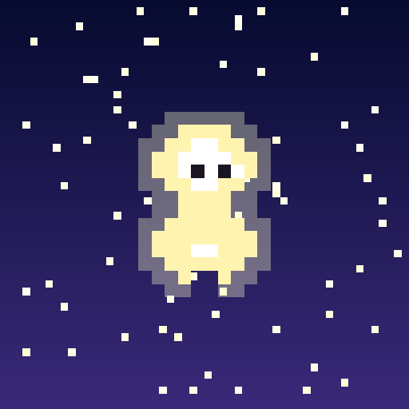
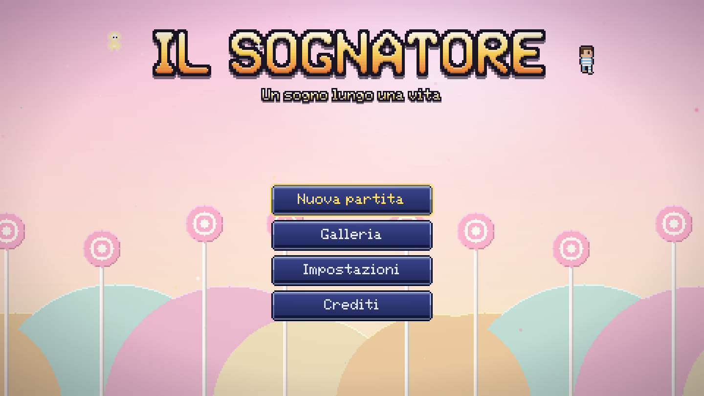
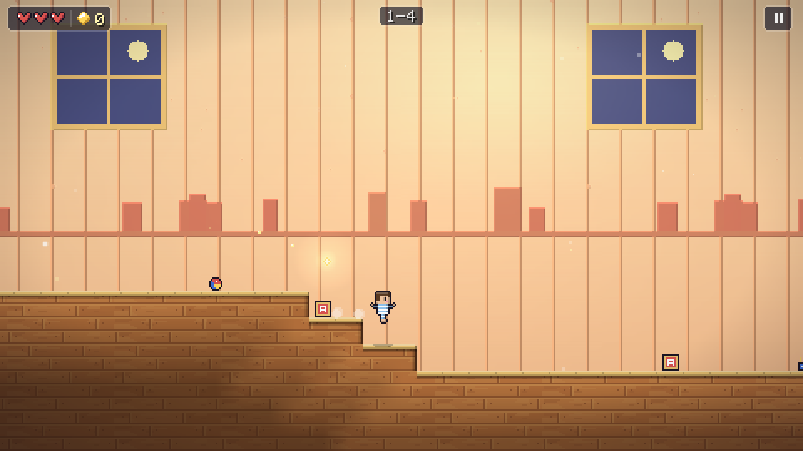
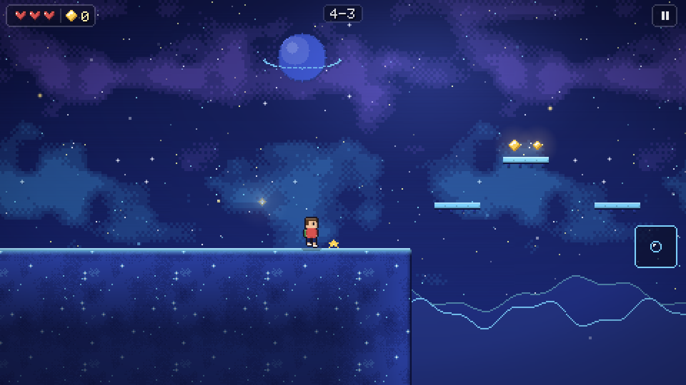
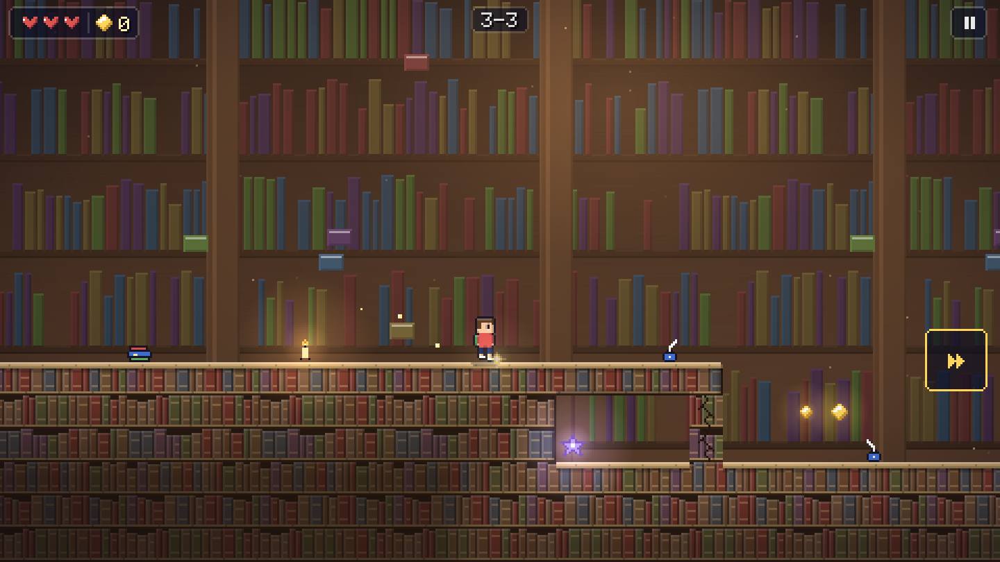
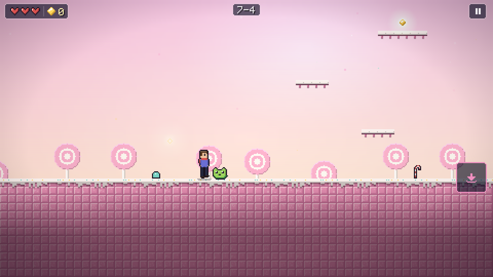
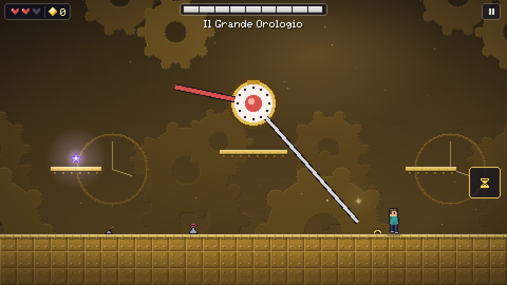

  

<h1 align="center">Il Sognatore</h1>

<i>Un sogno lungo una vita.</i>

  Platform 2D in pixel art · Android · Italiano e inglese

  

## La storia

Ogni sera, in cameretta, Flavio gioca con Chiara. Lei è fatta di luce, e solo lui può vederla.

Una notte un'ombra se la porta via. Flavio la insegue dentro il sogno, e il sogno non finisce più: lo attraversa da bambino, da ragazzo, da adulto. A ogni mondo lui cresce un po', e la luce di Chiara si fa un po' più lontana.

Il Sognatore è una storia d'amore. Solo che all'inizio era un'amicizia.

## Dieci mondi, una vita intera

Si parte a sei anni tra i giocattoli e si arriva a trenta davanti all'Incubo. Ogni mondo ha i suoi colori, la sua musica, i suoi nemici, un boss e un'abilità nuova che cambia il modo di giocare.

| | Mondo | Cosa impari |
|---|---|---|
| 1 | **La Cameretta** | A correre e saltare |
| 2 | **Prati di Nuvole** | Doppio salto |
| 3 | **Biblioteca Infinita** | Scatto |
| 4 | **Oceano di Stelle** | Bolla di sogno |
| 5 | **Città Capovolta** | Inversione di gravità |
| 6 | **L'Orologeria** | Rallenta il tempo |
| 7 | **Regno dei Dolci** | Schianto |
| 8 | **Sala degli Specchi** | Riflesso |
| 9 | **La Tempesta** | Planata |
| 10 | **L'Incubo** | Tutte le abilità insieme |

  
  

  
  

## Cosa ti aspetta

- **50 livelli**, cinque per mondo: quattro da attraversare e il quinto contro un boss.
- **Ogni partita è diversa.** I livelli nascono da un numero, il *seme del sogno*: partita nuova, livelli nuovi. Se un sogno ti è piaciuto, passa il numero a un amico e giocherà gli stessi livelli.
- **30 nemici e 10 boss**, dal Re dei Giocattoli al Grande Orologio, fino all'Incubo.
- **Un oggetto segreto in ogni livello.** Trovali tutti in un mondo per sbloccare un ricordo di Flavio e Chiara. Trovali tutti e cinquanta per vedere l'epilogo.
- **Una galleria** con le scene della storia, i ricordi e il bestiario dei nemici incontrati.
- **Una colonna sonora originale**: un brano per ogni mondo, più i temi del menu, della storia, dei boss e del finale.

  

## Tre modi di sognare

| Modalità | Per chi |
|---|---|
| **Sogno lucido** | Vite infinite, riparti dall'ultimo checkpoint. Per godersi la storia. |
| **Sonno agitato** | Cinque vite. Se finiscono ti svegli, e il mondo ricomincia da capo. |
| **Incubo** | Una vita sola. Si sblocca dopo aver finito il gioco. |

## Pensato per il telefono

Si gioca con due pollici: trascini a sinistra per muoverti, tocchi a destra per saltare, fai uno swipe per usare l'abilità. Niente pulsanti che coprono lo schermo.

Funziona anche con un controller Bluetooth o una tastiera.

## Per tutti

- Controlli per mancini, joystick regolabile in grandezza e trasparenza
- Salto alto automatico, per chi fatica a tenere premuto
- Velocità di gioco ridotta all'85% o al 70%
- Filtri per il daltonismo e pericoli riconoscibili dalla forma, non solo dal colore
- Fumetti più grandi, lampi ridotti, avvisi visivi per i suoni importanti
- Tre salvataggi separati, salvataggio automatico a ogni checkpoint

## Crediti

Idea, design e programmazione di **Flavio Ceccarelli**.
Grafica e musiche originali per Il Sognatore.
Realizzato con Godot Engine 4.

*A Chiara.*

---

Stai cercando come compilare o modificare il gioco? Le note tecniche sono in [docs/SVILUPPO.md](docs/SVILUPPO.md), la specifica completa in [docs/GDD.md](docs/GDD.md).
